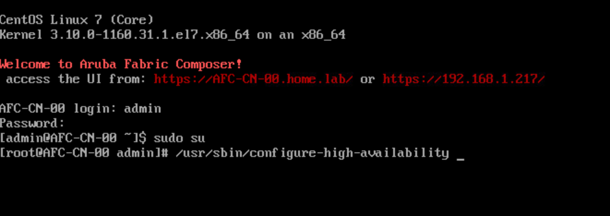
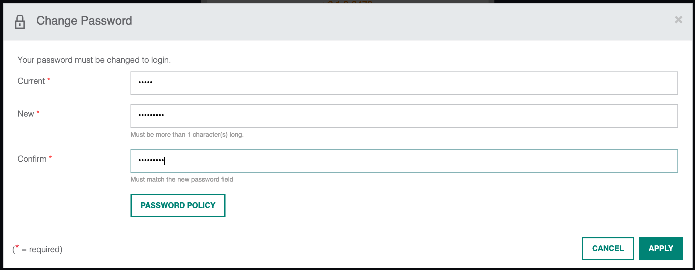

<!-- Google Tag Manager -->
<script>(function(w,d,s,l,i){w[l]=w[l]||[];w[l].push({'gtm.start':
new Date().getTime(),event:'gtm.js'});var f=d.getElementsByTagName(s)[0],
j=d.createElement(s),dl=l!='dataLayer'?'&l='+l:'';j.async=true;j.src=
'https://www.googletagmanager.com/gtm.js?id='+i+dl;f.parentNode.insertBefore(j,f);
})(window,document,'script','dataLayer','GTM-NWHJDNP');</script>
<!-- End Google Tag Manager -->

# Introduction

AFC can be installed as a single node or using multiple nodes. In this blog post, I will go through the process to install a three-node cluster using AFC 6.1. The cluster will be installed in my home lab environment using ESXi 6.5.

I like how AFC can be deployed as a VM. It means you can deploy it without needing any expensive hardware. You can spin it up as a VM and away you go. Easy-peasy.

For lab purposes, it's fine to deploy a single node. This is what I do in my lab environment.

## Hardware & Software Support

At the time of writing, AFC supports the following Aruba switch platforms running AOS-CX 10.6 and 10.7.

* CX 6300
* CX 8325
* CX 8360
* CX 8400

I'll also need a hypervisor for the install. Currently, AFC includes support for the following hypervisors;

* Vmware vSphere
* KVM
* Nutanix AHV

From a VM resource perspective, the minimum requirements are recommended;

* Small deployment consisting of a maximum of 8 switches and 2 integrations - 2 CPU / 8GB RAM / 100GB HDD.
* Large deployment consisting of more than 8 switches and 2 integrations - 4 CPU / 16GB RAM / 100GB HDD.

Note; It's always worth reading the latest release notes and installation guide to check the latest supported versions and system requirements. These can change depending on the software release. All documentation can be accessed via the Aruba support portal (ASP).

## Installation

The cluster nodes can be installed via two methods. The first method is by deploying an OVA in vSphere. Alternatively, you can boot from an ISO image. As part of this task, I will be using the ISO image. I will be using the naming convention AFC-CN-XX which stands for AFC-ClusterNode-XX. The internal node numbering is 00, 01 and 02 so I will also use the same numbering convention. Let's get started with the install.

Create a VM with 4 CPU / 16GB RAM / 100GB HDD and configure the VM as a red hat 7 64 bit image. Specify management network and mount ISO image. 


Start the VM and proceed with the HA installation. 


Choose Static IP address. Hit enter to continue.


The install will then begin unpacking the necessary files. Accept the license agreement and configure the necessary settings (IP, name, DNS, NTP, etc). Once finished, select OK to start the install. The install took around 30 minutes on my server.


Once the first node has been installed I then proceed to install nodes 1 and 2. To do so, I will perform the same installation steps as above for nodes 1 and 2. 

I now have all three nodes stood up once nodes 1 and 2 have completed their initial installation. The last step is to configure HA between the three nodes. I will now login to the CLI of node 0. By default, the username is admin and password aruba. Run the following command to start the HA deployment.

```
sudo su
/usr/sbin/configure-high-availability
```



Once initiated, the setup script will ask you for the IP address of node 1 and node 2 as well as the cluster VIP. Enter the necessary details and begin the setup.


Allow the process to complete without any interruption. Once finalised, each of the nodes will require a reboot. This will take place as part of the process to conclude the installation.


Post reload, you can open an HTTPS session to the cluster VIP to access the AFC web interface. The default username and password is admin/aruba. You will be presented with the following interface.


\
You will then be asked to change the default password. Provide a strong password and hit apply. Note, this changes the password for the GUI login only.



You will now have access to the cluster.

## Cluster verification

As with any deployment, it is always useful to verify it has been successful. You can use the following steps to verify the cluster state.

Login to the AFC GUI. Go to Configuration > Maintenance > High Availability. Here you will be presented with the health status of each of the nodes and the current cluster state.


Log in to the CLI of a node and run the following commands. SSH tunnels are used between cluster nodes for internal communications. Verify the status of the cluster services using the following command. Note, the output will show several services for all three nodes. An operational and healthy service will have a value of true. If the value is false then the service is not running. Check to ensure the services are running correctly.


Next, we can check the health of each node.


Confirm all nodes are present and available in the cluster. You can see from the output that node 0 is the leader in this example.


\
Verify the DB is running on each node.


## Changing the Linux admin password

By default, each VM is assigned the default credentials of admin/aruba. Let's log in to each of the nodes via ssh and change it for security purposes.

SSH to each of the cluster nodes. Run the passwd command and provide new credentials.


## Summary

During this post, I have covered the following;

* The hardware and software requirements for AFC.
* AFC 6.1 cluster installation using the ISO method on ESXi.
* Configuring the cluster HA.
* Verifying the cluster status post-installation.

Hopefully, this has provided some useful insights regarding how you would install a cluster from scratch. Next up, we will have an overview of the AFC GUI layout.

[Next Article: AFC GUI Overview](/post/afc-gui-overview/)