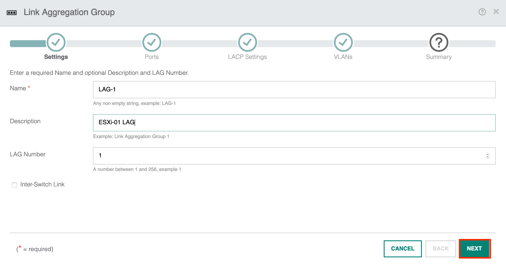
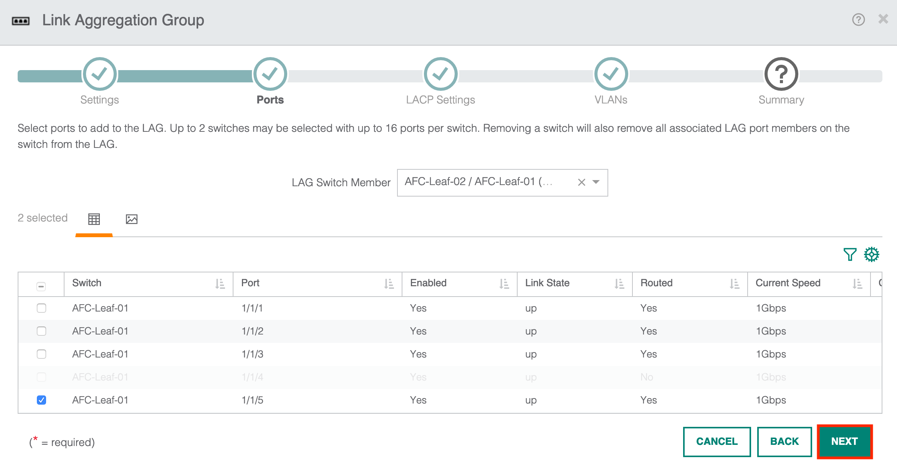
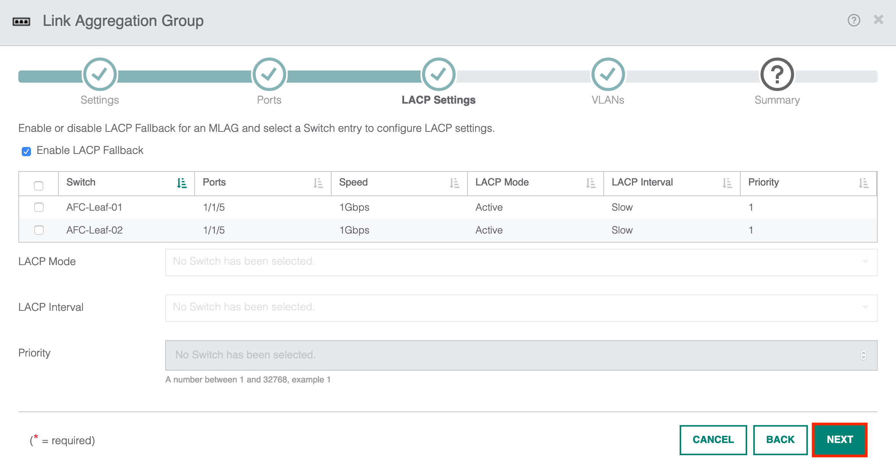
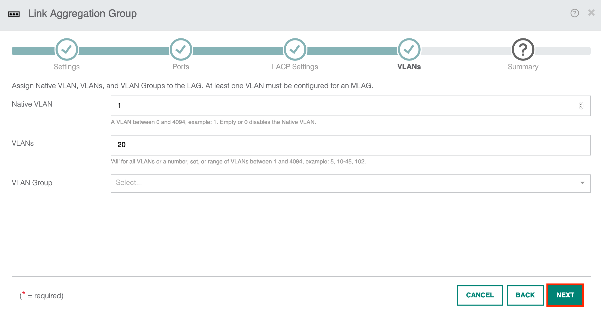
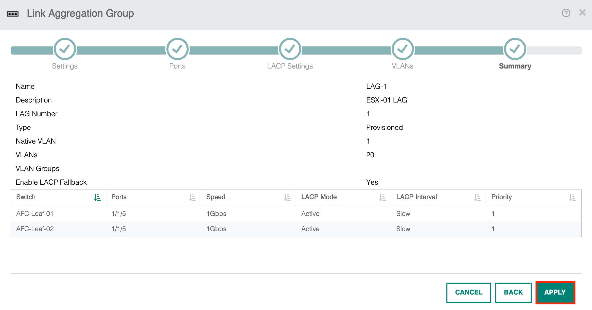
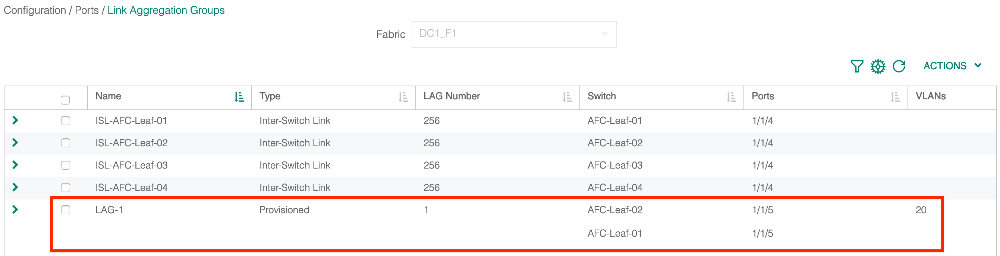
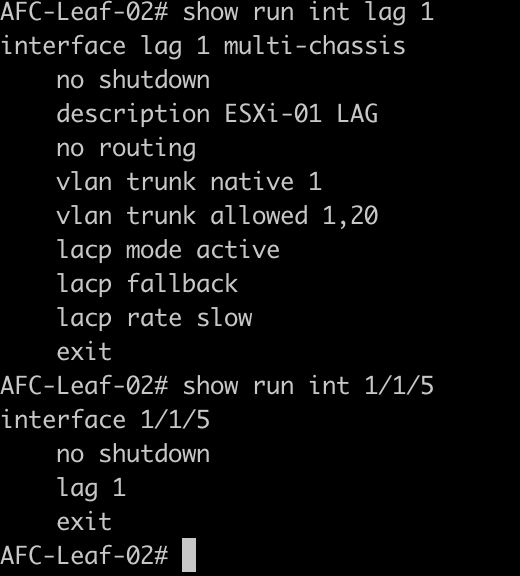
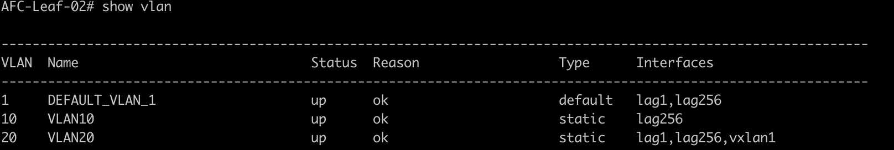
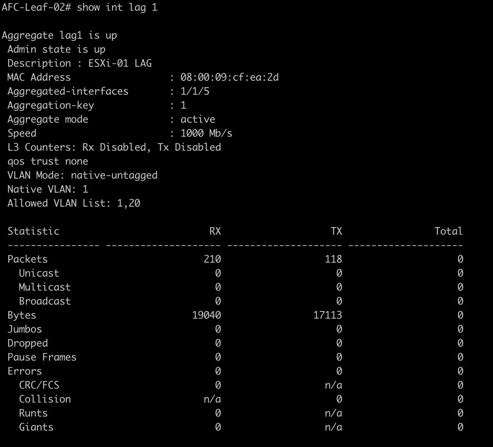
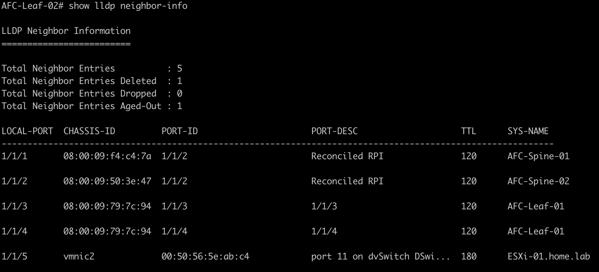

Hosts can be connected to the leaf switches in multiple ways. This can include single or dual-homed links using active/active or active/standby NIC deployments. It is common to deploy a VSX LAG. This allows the host to connect to both VSX switches whilst actively forwarding on each link thus providing more bandwidth and resiliency to the connected device.

## Configuring a VSX LAG

To begin the configuration, go to Configuration > Ports > Link Aggregation Groups. Select Add from the Actions menu.

The first thing I need to do is assign the LAG name, description and ID number.

I define the ports I wish to add to the LAG. Here I will add interface 1/1/5 on Leaf-01 and Leaf-02.

I then configure the LACP settings. I am using active mode with a slow interval rate.

The VLAN configuration allows me to define which VLANs I want to allow across the link. In this example, I will use VLAN 1 as the native and allow VLAN 20 for data traffic.

A summary page is presented with the LAG information. Hit apply to push out the config.

Returning to Configuration > Ports > LAG. I can see LAG-1 has been deployed to the leaf switches.

Moving over to the CLI, the output confirms the LAG has been deployed.

The VLAN is assigned to the correct interface.

The lag is up and functional.

I can also see the downstream host from the LLDP information.

That concludes the configuring of a VSX LAG interface for this example!

## Summary

During this post, I have covered the following;

* Configuring a VSX LAG.
* Assigning the VLAN and LACP parameters.
* Verifying the configuration.

[Next Article: AFC Intergration with VMware vSphere](/post/afc-intergration-with-vmware-vsphere/)