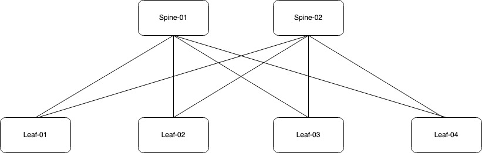

OK, let's get started. First things first, the fabric composer is fresh out of the box and does not contain any devices to date. We will need to start populating the fabric composer. To get started, we must go ahead and add the devices into AFC. To perform this task, I will be using the guided setup.

For reference, I will be using a Spine-Leaf topology;

## Switch Discovery

To onboard devices, we need to make sure each switch is configured with a IP address, local admin account, SSH and Rest API access.

Moving across to the wizard, I will proceed with the "Switches" setup to begin the device discovery process.

Once selected, the wizard will prompt for information about the devices. I have specified the IP range for my devices, the local admin credentials and the password I wish to use for the AFC_Admin local user account. Select apply to push the config.

In my lab, I have assigned each device a static IP address. You can either assign static IP's or use DHCP depending on your preference. Regardless of which path you choose, you need to know the IP address of each device so you can add them to the fabric.

The fabric composer will use the IP address information to connect to each device. AFC performs a login using the local admin account. The fabric composer will create a new AFC_admin account and use it moving forward. The device is then onboarded into the system.

Once the onboarding is complete, I am returned to the main page. I can see the switches in the inventory and they are in a healthy state. The status of each device is currently "Unassigned" meaning the device(s) have not yet been assigned to a fabric.

## Adding switches into a Fabric

I will now begin the Fabric creation. In this example, I will be creating a single fabric named DC1_F1. It will act as a logical container and provide management of my devices. In a real-world deployment, you may have multiple fabrics depending on your requirements.

Using the wizard I will add a fabric.

I now provide information about the fabric. Most of it is self-explanatory as you can see below. One thing to note is the fabric "type". AFC supports two types of fabric. The first type is a data fabric that supports switches participating in the data path. The second type is for OOB management switches using the CX6300.

I will now proceed with a data fabric and hit apply.

The fabric is now visible in the GUI.

Let's assign the discovered switches to the fabric. Go across to the wizard and select the "Assign switch to fabric" option.

First, I will add both Spine-01 and Spine-02 and define their role within the fabric as a Spine switch. I will also choose to initialise the ports and allow LLDP discovery. Once selected, you need to click the "Add" button before applying the configuration.

The switches have been added and I can now click apply to push the config to each spine switch.

The same process will now be applied to the leaf switches.

AFC and the devices will be synchronised. The health status will change to a green "healthy" state and each device will be assigned to your designated fabric.

If I go back to the main dashboard, there is a total of 6 switches.

## Summary

* Reviewed the switch prerequisites for AFC onboarding.
* I added the switches into the AFC inventory.
* I demonstrated how to add switches into the fabric.
* Reviewed the switch and fabric status.