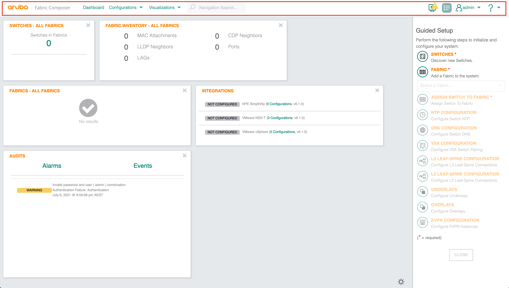
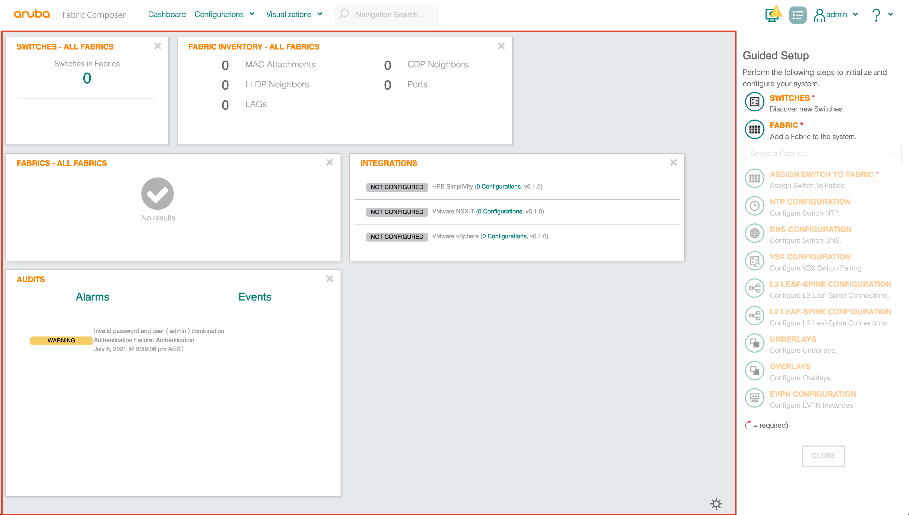
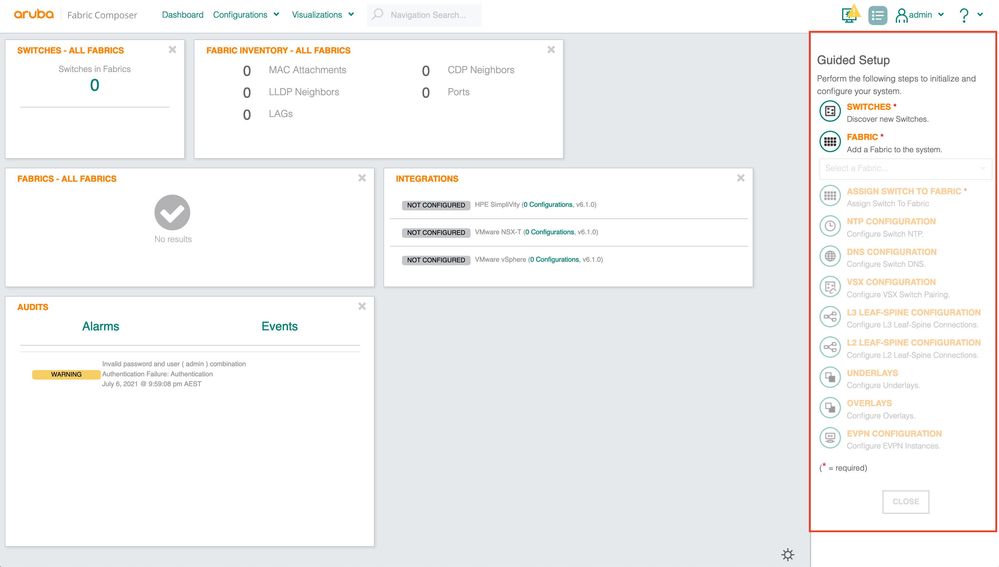
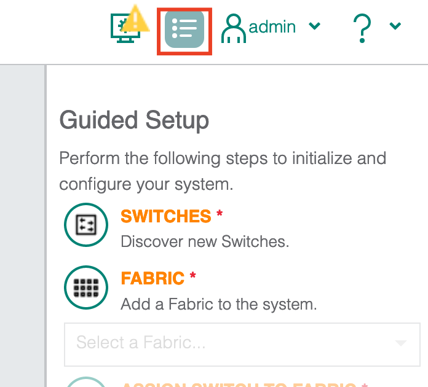

<!-- Google Tag Manager -->

<!-- End Google Tag Manager -->

I would like to pause here to review the GUI. To be honest, the GUI is quite straight forward but I thought it would be useful to review the layout for new users.

By default, the AFC dashboard will be displayed when you log in. The dashboard is the home page and provides you with a high-level overview of the system.

At the top of the page, we have the menu bar. The menu provides access to the dashboard, configuration, network visualisations and the guided setup as shown below in red. Initially, the GUI will not contain much information. Information is populated once we begin onboarding switches.

In the middle of the screen, you are presented with several tiles. The aim of the tiles is to display useful information such as device status, fabric information, syslog events, device info, and integration information. The tiles can be customised to your preference. This area of the page will change as you work your way through the menu items. It will be your main work area in AFC.

To the right of the page, you have the guided setup. The guided setup provides simplified workflows for common tasks in the fabric. Click the item in the setup to launch a workflow task.

As a side note, you can hide the guided setup at any time by selecting the button shown below.

As we progress through the series, we will begin to see more of the AFC interface and its components.

Now let's begin onboarding some devices onto the cluster.

[Next Article: AFC Fabric Initialisation](/post/afc-fabric-initialisation/)