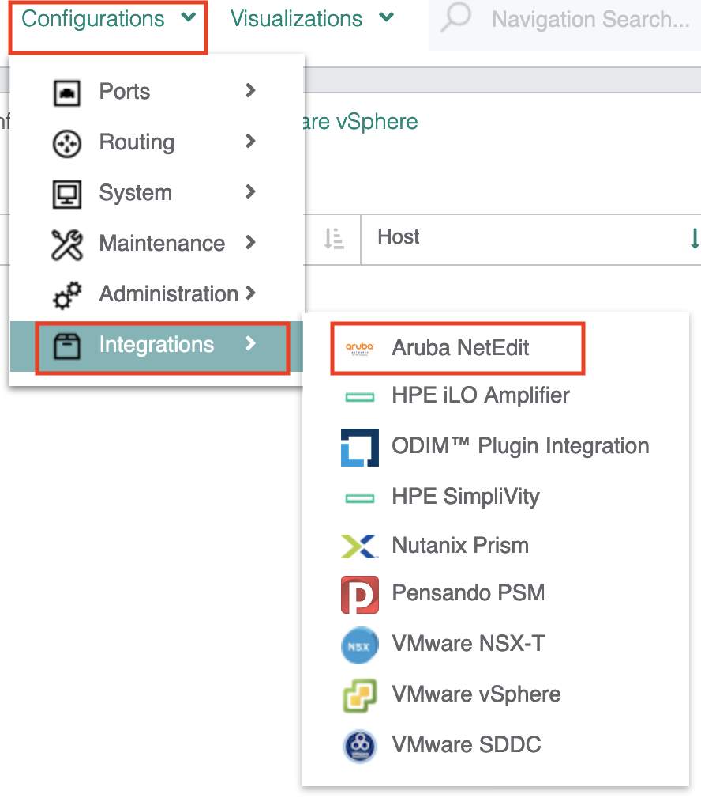
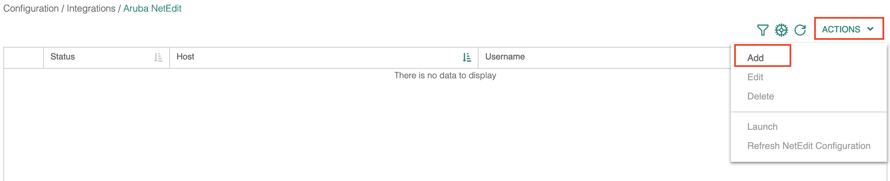
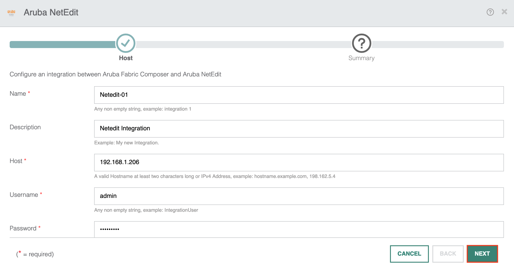
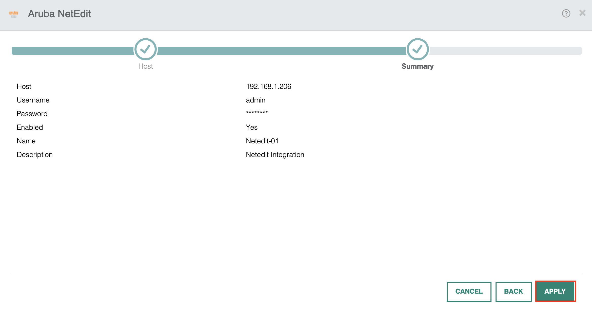
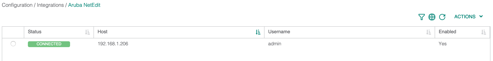
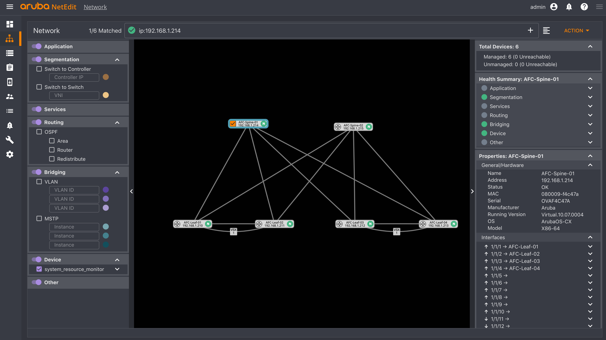

Aruba NetEdit provides automation and workflows using a traditional CLI-like environment. For those users who wish to continue to use NetEdit alongside AFC, then you will be glad to know you can easily integrate the two tools. The AFC and Netedit integration allow you to open Netedit directly from AFC. This gives you seamless functionality of both tools in your environment.

In this post, I will quickly run through how to set up the integration between the two.

## NetEdit Integration Configuration

Go into Configuration > Integrations > Aruba NetEdit.

Now select Actions > Add.

Provide the NetEdit server IP address and login credentials.

Apply the settings to complete the integration.

The NetEdit integration has successfully connected as seen on the integration page.

At this point, the integration has been successfully completed. Now, I can go into the Visualizations menu to view the network topology. From there, I can right-click on any network device and choose the "Launch Netedit..." options to load Netedit for use. 

This will then allow you access to your NetEdit environment to perform tasks.

## Summary

In this blog post, I have covered the following;

* Configuring AFC and Netedit Integration.
* Verifying the Integration.
* Demonstrating how to access Aruba NetEdit via AFC.