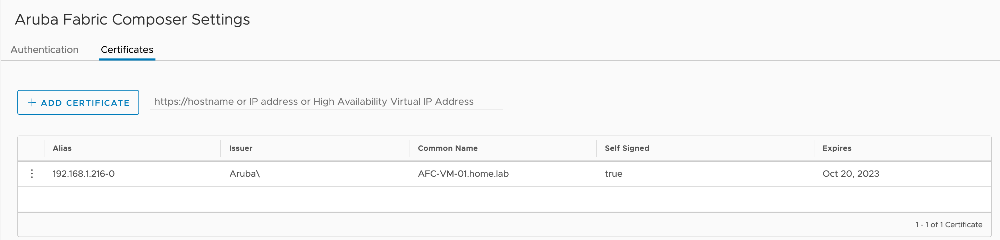

As I touched on earlier, AFC includes support for several third-party integrations. This includes products from HPE/Aruba, Vmware, Nutanix and Pensando.

You may be thinking how could this be useful to me in my environment? Think about the complexity of troubleshooting network issues, the number of moving parts and how difficult it can be to verify the configuration, generating visualisations of the network or simply automating changes as your environment grows. These are the kind of things that can be achieved by using integrations.

Let's take an example. Say you wish to move VMs in your environment to several new hosts. Many organisations will need cross-collaboration between the server and network teams to ensure this can be implemented. This could take days, weeks or maybe more effort. By utilising the vSphere integration, AFC can detect virtualisation events to assist with the migration. By detecting the vMotion event, AFC can query the switches in the fabric to ensure they have the necessary VLAN configuration available to support the move and operations on the new hosts. If the VLANs do not exist then AFC can apply the configuration and part of the virtual machine integration.

## vSphere Integration Setup

To access the available integrations you can go to Configuration > Integrations.

As part of this example, I will now add a Vmware vSphere integration into AFC by selecting the vSphere integration option.

Now choose Actions > Add.

Provide details of the integration name, host IP and credentials. Before proceeding you can validate the connection. This performs a query to vSphere to ensure they can communicate.

I define which VLANs can be provisioned in the environment to the directly connected hosts.

Enable discovery protocols using LLDP.

Now complete the integration setup.

The AFC cluster has successful connectivity with the vSphere environment.

Compute hosts are added into AFC after the integration is complete. The example below shows a single ESXi host in my environment. You can see AFC is able to detect the full end-to-end path between the VM and the CX switches. The devices in the chain include lots of useful information regarding the configuration of each component. You can access this information by selecting the component in the visualisation. This can prove very helpful when trying to visualise the traffic path or assisting with various troubleshooting issues.

Each element can be selected to show useful information for that particular component.

The next part is completely optional. However, some people may wish to install AFC as a plugin on the vSphere console. To do so I will go back to the VMware integration page. Then go to Actions > Register plugin.

AFC already has the necessary Vmware credentials to communicate with vSphere. Now open your vSphere environment. When I log in, I can see a plugin notification.

The AFC plugin is listed in vSphere.

I will need to configure the AFC credentials and certificate to complete the plugin installation. This must be completed in the vSphere console.

Under Administration, go to settings > authentication > update settings.

Enter the AFC credentials.

Under the AFC plugin, go to settings > certificates. Specify the AFC IP address to add the certificate.

Add the certificate.

The certificate has been added successfully.

The connection has been successfully authenticated as shown below.

The AFC console is now available for use within vSphere.

That concludes the setup between AFC and vSphere.

## Summary

During this post, I have covered the following;

* Configuring integration between AFC and vSphere.
* Installing the AFC plugin in the vSphere console.
* Verifying the configuration.

[Next Article: AFC Integration with Aruba NetEdit](/post/afc-integration-with-aruba-netedit/)