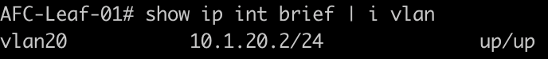

In this post, I will create a VXLAN distributed gateway SVI using VLAN 20 from the previous article.

To create the SVI, I will move across to the configuration menu. IP configuration is performed in the relevant VRF. To add an SVI go into Configurations > Routing > VRF.

Select the VRF. In this example, I am working with the default VRF. Select actions > IP interfaces.

Under the "IP Interfaces" section, choose Actions > Add.

The first task is to define the SVI and necessary details. Here, I provide the VLAN ID and IP addressing. I also specify which devices I want to configure the SVI on.

Then I provide the necessary VSX configuration for the VLAN interface. This includes the active gateway IP address and the gateway MAC address.

A name and description are then applied to the task.

And now the final summary page is shown. Hit apply when you are ready to push the config.

## Verification

If I go back to the interfaces page, I can see the SVI interfaces in the GUI. In the example below, we can see the SVI for VLAN 20 has been deployed to all four of the leaf switches.

Moving back across to the CLI on Leaf-01, the SVI has been deployed and is currently up.

The VSX config has also been deployed.

This article was short and sweet but it’s a task that will come up in your AFC environment.

## Summary

During this post, I have covered the following;

* Creating a distributed gateway SVI.
* Deploying the SVI to the devices.
* Configuring the VSX parameters.
* Verification examples.

[Next Article: AFC Configuring a VSX LAG](/post/afc-configuring-a-vsx-lag/)