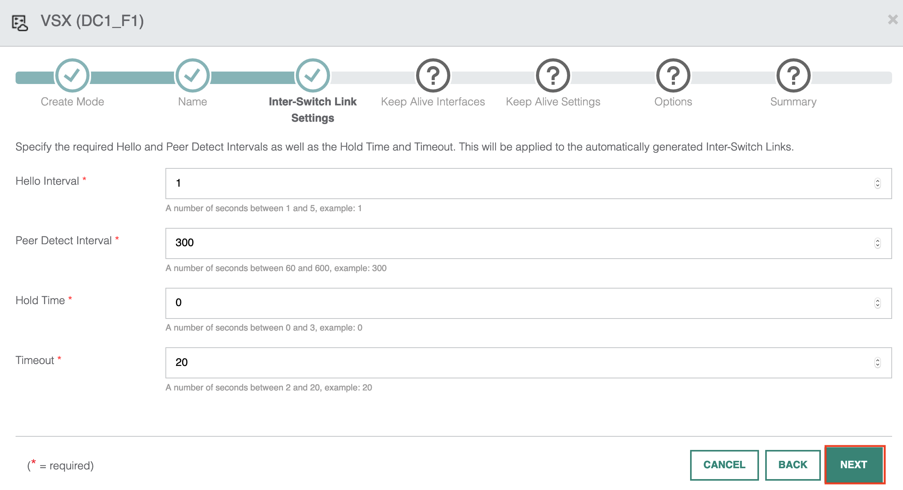

There is strong demand for high availability in the Data Centre. Aruba's Virtual Switching Extension (VSX) is used to achieve high availability between a pair of switches.

In this example, I will be using the same spine and leaf topology;

I will configure leaf-1 and leaf-2 as the first VSX pair. Leaf-3 and leaf-4 will become the second VSX pair.

## VSX Configuration

Select the VSX option from the wizard.

There are two methods to deploy VSX. The first method detects which devices are connected to each other automatically. To do this, AFC uses LLDP and the switch role to help determine the connectivity. 

In the second method, you can choose the manual configuration option. This allows you to select which device you want to configure as a VSX pair. For this example, I will automatically generate the VSX pairs.

I provide a name and description for the VSX job.

I now configure inter-switch link (ISL) settings such as the hello and hold timers for the VSX operations. By default, AFC will provide you with the recommended values. These are sufficient for most environments. I will proceed with the default settings.

Next is the VSX keepalive configuration. Here I have two options. The first option is to configure a loopback interface. The loopback interface will become reachable over the ISL link and does not need a dedicated point-to-point link. This is useful in scenarios where you need the port for other purposes. The second option is to use a dedicated interface. This will use a point-to-point link between the two devices. If you can spare the ports and cost then I would recommend using a dedicated link for a production environment. I will now go ahead and use a dedicated link for the keepalive.

I then use the default hello and hold timers for the keepalive link.

Next, I will specify the link delay timer and the system mac address pool. The system mac address pool will assign a unique system mac address per VSX pair. The pair of switches will share the same system mac. The purpose of the system mac is to prevent traffic disruptions, in particular failure scenarios. The linkup delay timer allows you to delay the initialisation of downstream VSX links following a VSX device reboot or an ISL flap.

The final page displays the VSX summary information. Ensure you verify the summary information and hit apply to push the config.

## Verification

Go to Configuration > System > VSX. Review the information to ensure the VSX config is correct. The configuration shows the VSX pairs have been detected and configured.

VSX can also be verified using the CLI. The following example shows the VSX status on leaf-1.

## Summary

During this post, I have covered the following;

* Deploying VSX Pairs.
* Using a dedicated P2P link for VSX.
* Configuring VSX parameters.
* Verifying VSX operations.

[Next Article: Deploying a spine-leaf VXLAN DCN using AFC](/post/deploying-a-spine-leaf-vxlan-dcn-using-aruba-fabric-composer/)