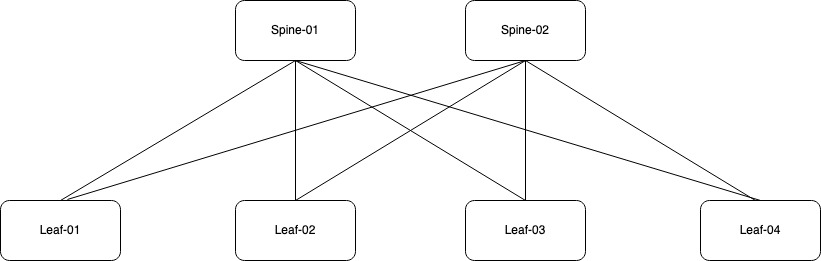

In this article we will look at how AFC can be used to deploy a small spine leaf topology using VXLAN. For reference, I will be using the following topology.

The network is comprised of two spine switches and four leaf switches. Each pair of leaf switches has been deployed using VSX as shown in the previous article. Now I will use AFC to deploy VXLAN. 

Normally this would take a massive amount of effort. It can require a considerable amount of hours to generate the necessary config and perform the validation. Using AFC, you can have a complex topology deployed very quickly. Lets take a look at an example.

## Underlay Configuration

The first step is to implement the underlay configuration. To begin select the Spine Leaf option from the wizard. From there, we can choose to automatically detect the spine leaf devices or to manually specify them. I will select automatic detection and proceed.