<!-- Google Tag Manager -->

<!-- End Google Tag Manager -->

Deploying NTP and DNS services is definitely not a hot topic but it is a useful one. This section will review deploying both services to the managed network using Fabric Composer. 

## Deploying NTP

To deploy the services, we can use the guided setup. Select "NTP configuration" from the wizard.

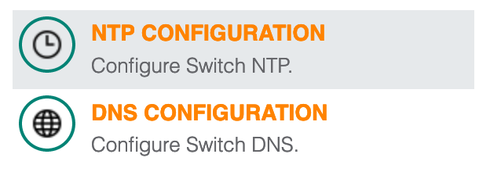

Enter your NTP server address details.

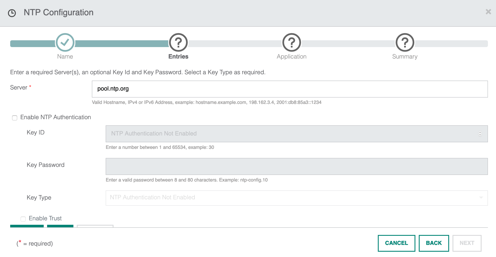

Scroll down and select "Add" to add the server configuration. Hit next to proceed.

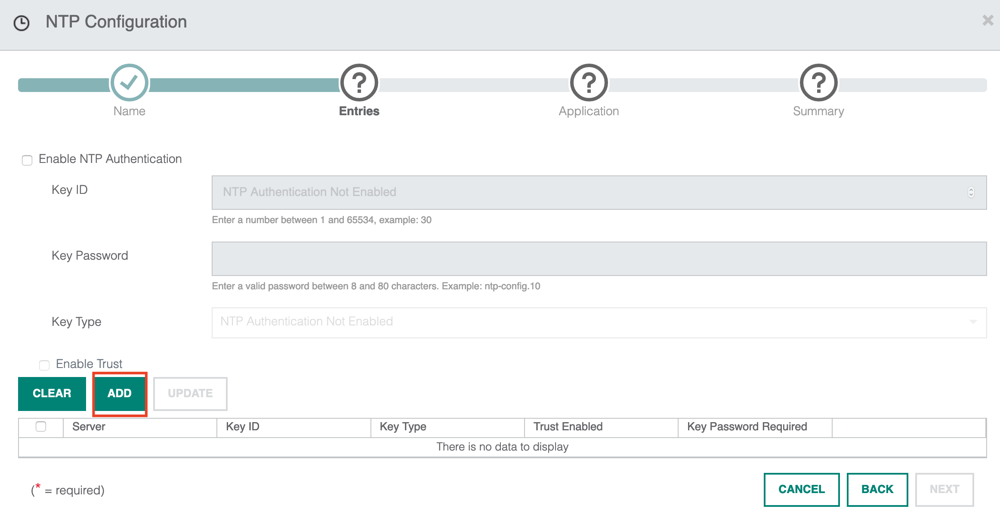

I can now choose how to apply the NTP configuration. The configuration can be applied to individual switches or to an entire fabric. I will push the configuration to the entire fabric so all switches use the same config.

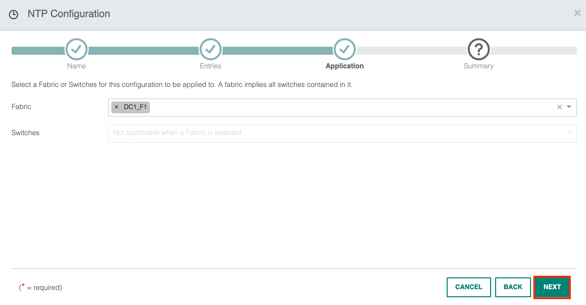

A summary of the configuration is now displayed. Once confirmed, you can go ahead and click apply to push the configuration.

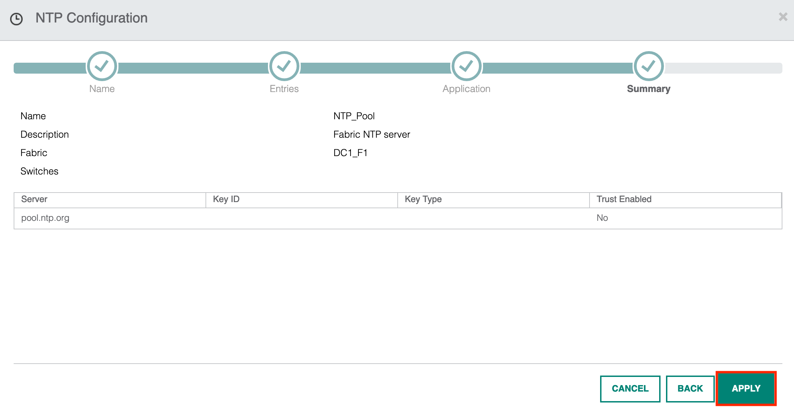

You will now return to the configuration screen. The window shows the NTP pool has been configured and applied to the fabric DC1_F1 as shown below.

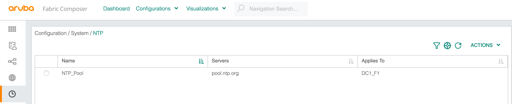

## Deploying DNS

To proceed with the DNS configuration, I return to the wizard. Select the "DNS configuration" option.

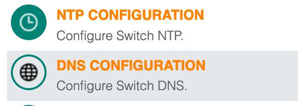

Specify the domain name and list of DNS servers and proceed to the next screen. 

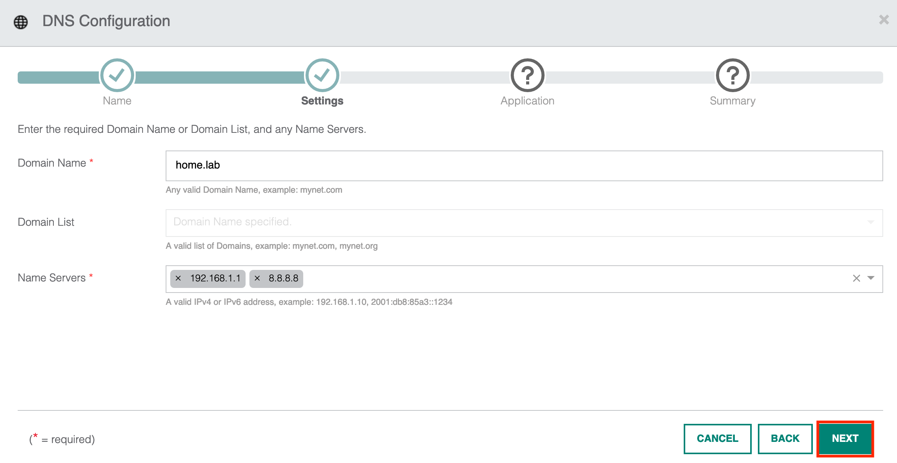

I can now apply the config on individual switches or to the entire fabric. I will proceed with the entire fabric.

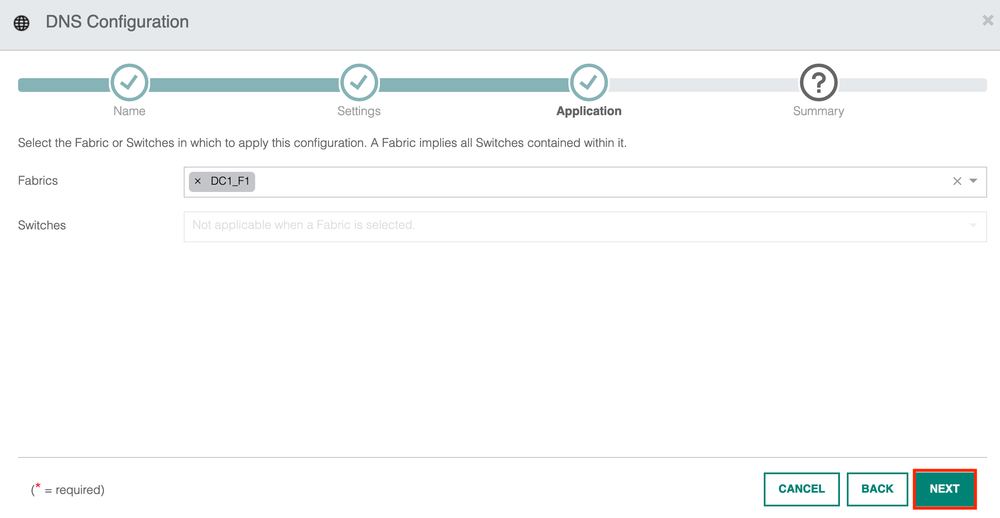

A summary of the configuration is shown. Select Apply when you are ready to continue.

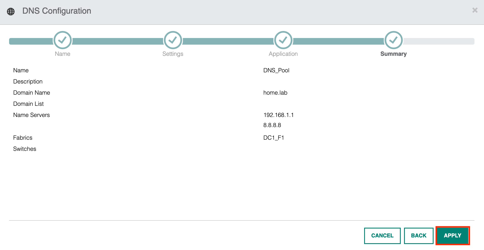

I am now redirected to the DNS configuration page which displays my configuration.

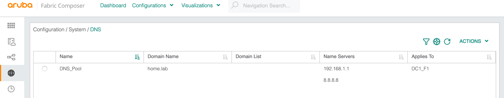

## Verification

Before moving onto the next section I would just like to show what's going on under the hood. As part of the deployment, AFC will communicate with the switches using the API and SSH. If we log in to a switch, you can view the configuration which has been applied to the device. The wizard is applying CLI commands as part of its workflows. 

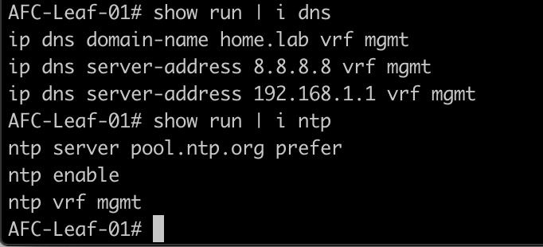

This is one of the things I like about AFC -  the fact I can still go into the CLI and perform changes. I am not locked out or restricted from the CLI in an AFC deployment. I have full CLI access so I can go ahead and run all of the commands I am familiar with. 

You can also perform the relevant show commands on the CLI to run further validation as per the example below.

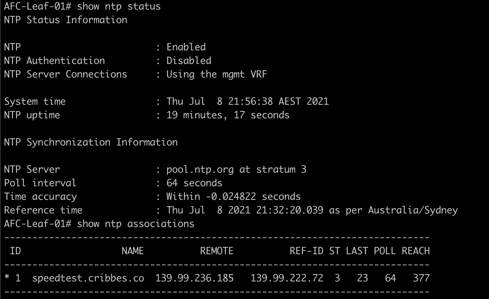

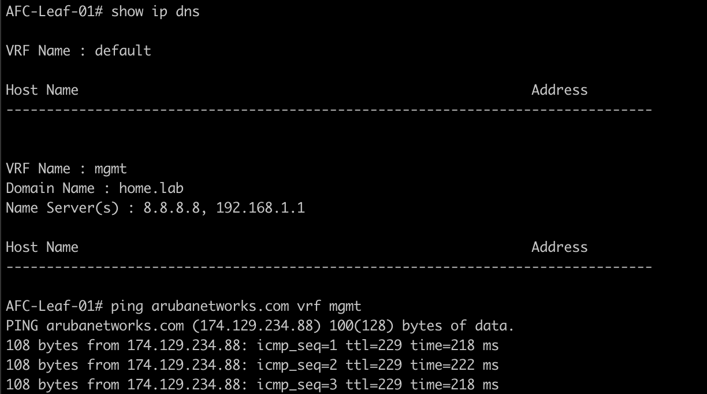

## Summary

* Deployed DNS and NTP using the wizard.
* Reviewed the configuration from the CLI perspective.
* Verified each service is working correctly.