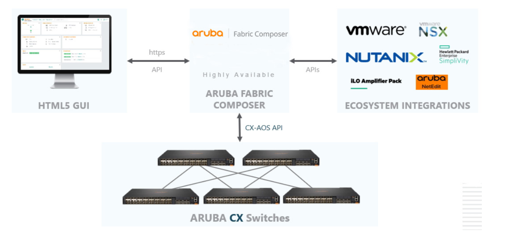

# Introduction

The blog series intends to provide an introduction to the Aruba Fabric Composer (AFC). The series will cover a range of topics in AFC. Think of the posts as more of a how-to guide without deep-diving into the underlying protocols. The articles are for my own learning purposes. I hope they will prove useful to others.

Data Centre architects and engineers know how complex design and implementation can be. Regardless of the deployment size, the amount of effort can be large. And this may be for only a single site! Times the number of sites by many and you start to wonder what is the best way to manage it.

Many organisations continue to implement network changes using the CLI. This can become a laborious, time-consuming task that prolongs project and BAU timelines. The amount of effort can roll into the weeks or months per change. Anything we can do to help mitigate or reduce some of these issues is welcome. Customers are starting to look towards automation and orchestration tools for help.

## Whats is AFC?

Aruba Fabric Composer is a data centre orchestration tool that simplifies the deployment of network changes and day-to-day operations. Preconfigured workflows automate complex tasks with minimal input.

From a high-level view, the AFC solution is made up of several components. This includes the AFC cluster, third-party integration packs, and the managed networks.

They always say a picture says a thousand words so here is a nice solution diagram from Aruba.

The cluster is deployed using three nodes for high availability. In the event of a node down situation, the remaining nodes can continue to function. This helps maintain the services of the cluster whilst the node is restored.

The cluster is the management plane and provides access to the orchestration GUI. From the interface, they can perform network changes and monitor the environment.

Changes between AFC and the managed fabric(s) are API-driven. The config is pushed to the managed switches without an engineer logging into the device.

AFC supports third-party integration packs. The packs provide visibility into workloads and assists with troubleshooting complex topologies. Event-driven workflow automation is also supported. The integration packs provide integration with solutions from vendors such as Aruba, HPE, VMware, and Nutanix. Event-driven automation support is available via the StackStorm integration.

In the next article, I will take a look at the cluster installation.